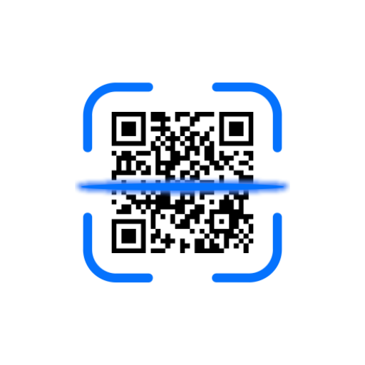

<p align="center">
  
</p>

<h1 align="center">Scan</h1>

<p align="center">
  <strong>A lightweight, privacy-first Android QR and barcode scanner.</strong><br>
  Built with Jetpack Compose, CameraX, and Google ML Kit.
</p>

<p align="center">
  <a href="https://github.com/HrshD1eux/Scan/releases/latest"></a>
  <a href="https://hrshd1eux.github.io/Scan/"></a>
  <a href="https://github.com/HrshD1eux/Scan/blob/main/LICENSE"></a>
</p>

---

## Overview

Scan starts directly into the viewfinder without startup lag or ads. It detects multiple barcode formats on-device, classifies content into actionable types (UPI payments, URLs, Wi-Fi credentials, vCards, SMS, coordinates, OTPs), and triggers corresponding native Android system handlers.

### Key Features

- **Instant Viewfinder:** Powered by CameraX `ImageAnalysis` operating at 1080p with continuous frame debounce.
- **Deep Intent Routing:** Native dispatch for UPI payments, Wi-Fi configuration (`WifiNetworkSuggestion`), contacts, navigation, and web URLs via Chrome Custom Tabs.
- **Offline QR Sharing:** Generate and display high-contrast QR codes directly from custom text or clipboard content for instant face-to-face transfer.
- **Low-Light Assistant:** Ambient light sensor integration with automatic torch activation or pulse suggestion.
- **Gallery & Share Sheet:** Scans images directly from the gallery or incoming Android share intents.
- **Local History & CSV Export:** Encrypted Room SQLite database with custom notes and CSV export via Android `FileProvider`.
- **System Integration:** Android Quick Settings Tile and App Shortcuts for instant access.

---

## Architecture

The project adheres to modern Android engineering best practices:

- **UI Layer:** Jetpack Compose with Material 3 theming (supports Dynamic Color / Material You on Android 12+).
- **State Management:** `MainViewModel` utilizing Kotlin Coroutines and `StateFlow` for unidirectional data flow.
- **Vision Pipeline:** Google ML Kit barcode vision pipeline with ZXing fallback encoders.
- **Storage:** Room Database for persistent scan records and Jetpack DataStore Preferences for user configuration.

---

## Project Structure

```
app/src/main/java/com/HrshD1eux/Scan/
├── MainActivity.kt        # Entry point and Compose root
├── MainViewModel.kt       # Application state and scan event handling
├── ScanTileService.kt     # Android Quick Settings tile
├── actions/               # Intent creation and system action dispatchers
├── camera/                # CameraX analyzer, preview, and sensor managers
├── history/               # Room entities, DAO, migrations, and CSV export
├── parser/                # ML Kit barcode classification and content models
├── scanner/               # Multi-item sliding LRU duplicate debounce
├── ui/                    # Jetpack Compose UI screens, components, and theme
├── updater/               # In-app update manager and package installer
└── utils/                 # QR matrix generator utilities
```

---

## Build & Testing

### Prerequisites
- Android Studio Iguana / Jellyfish or newer
- JDK 17
- Android SDK 34 (minSdk 24)

### Running Unit Tests
```bash
./gradlew testDebugUnitTest
```

### Building APK
```bash
./gradlew assembleDebug
```

---

## License

This project is licensed under the **GNU General Public License v3.0 (GPL-3.0)**. See the [LICENSE](LICENSE) file for details.
